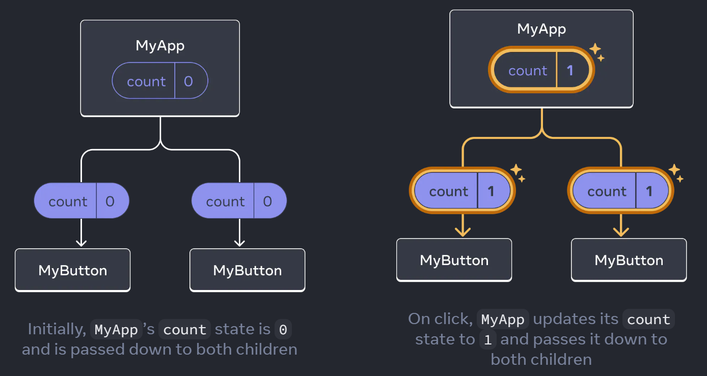

# In this series, you'll learn

## ⭐Components

### Reference

- https://react.dev/learn#writing-markup-with-jsx

### Basics

- Component Name
  - Component name should be **capitalized** and be the same as the component file name
- Component Export
  - To separate the component from the entrance file `App.js`, we need to use `export default function` instead of `function` alone.
  - Can only used on the main component
- Use JSX
  - component also can’t return multiple JSX tags
    - You have to wrap them into a shared parent, like a `
...
` or an empty `<>...</>` wrapper
  - Display Data
    - JSX lets you put markup into JavaScript
    - Curly braces let you “escape back” into JS so that you can embed some variable from your code and display it to the user
      - `<h1>{user.name}</h1>`
  - Add Styles
    - Using normal CSS
      - ``
        - `className` 相当于 html `class`
    - Using JS
      - `style={{
    width: user.imageSize, height: user.imageSize, }}`
- `return()`
  - Each component returns a piece of JSX code to be rendered on page
- 📌 Case
  - _[AboutPage](https://github.com/Jenniferwonder/react-tutorial/blob/main/src/components/01-quick-start/AboutPage.jsx)_

### Conditional Rendering

- Case-1-`if...else`
- Case-2-`test? a:b`
- Case-3-`&&`
- 📌 Case
  - _[Conditional](https://github.com/Jenniferwonder/react-tutorial/blob/main/src/components/01-quick-start/Conditional.jsx)_

### Render Lists

- `.map()` method
- `key`
  - `<li>` has a `key` attribute. For each item in a list, you should pass a string or a number that uniquely identifies that item among its siblings.
- 📌 Case
  - _[Lists](https://github.com/Jenniferwonder/react-tutorial/blob/main/src/components/01-quick-start/Lists.jsx)_

## ⭐Event Update

### Respond to Events

- `onClick={handleClick}`
- 📌 Case
  - _[Click](https://github.com/Jenniferwonder/react-tutorial/blob/main/src/components/01-quick-start/Click.jsx)_

### Update Screen

- `useState` Hook
  - `import { useState } from "react";`
  - `import { React } from "react";`
- 📌 Case
  - _[UpdateClick](https://github.com/Jenniferwonder/react-tutorial/blob/main/src/components/01-quick-start/UpdateClick.jsx)_

### Hooks

- Functions starting with `use` are called _Hooks_.
- Rules
  - You can only call Hooks at the **top** of your components (or other Hooks)
  - If you want to use `useState` in a condition or a loop, extract a new component and put it there
- other built-in Hooks
  - https://react.dev/reference/react

## ⭐Share Data between Components

### 

### Move the _state_ up from the component to its parent

### Pass the _state_ and _Event Handlers_ as _props_ to each component used in the parent app

- `<MyButton count={count} onClick={handleClick} />`

### Let the component to read the _props_

- `MyButton({ count, onClick })`

### 📌 Case

- _[ShareData](https://github.com/Jenniferwonder/react-tutorial/blob/main/src/components/01-quick-start/ShareData.jsx)_
